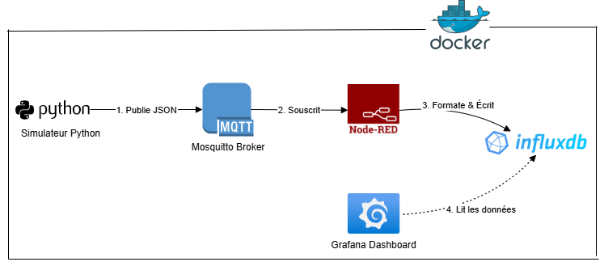

# 🏥 IoT Healthcare Monitoring System

A comprehensive Telemedicine Platform designed to monitor multiple patients' vital signs in real-time. This project leverages a microservices architecture to collect, process, store, and visualize biomedical data, providing critical alerts to medical staff.

Developed as part of the Applied Computer Science (S5) curriculum.

## 📋 Table of Contents
- [Overview](#-overview)
- [Architecture](#-architecture)
- [Features](#-features)
- [Technological Stack](#-technological-stack)
- [Prerequisites](#-prerequisites)
- [Installation & Setup](#-installation--setup)
- [Usage Guide](#-usage-guide)
- [Screenshots](#-screenshots)
- [Project Structure](#-project-structure)
- [Author](#-author)

## 🧐 Overview

In the era of e-Health, remote patient monitoring is essential to reduce hospital congestion and ensure continuous tracking of at-risk individuals. This system simulates a hospital environment where sensors transmit data to a central server for analysis.

**Key capabilities:**
- **Real-time Tracking**: Heart Rate (BPM), Body Temperature, Oxygen Saturation (SpO2), Blood Pressure.
- **Multi-Patient Support**: Simultaneous monitoring of 3+ patients with unique IDs.
- **Intelligent Alerting**: Automatic detection of critical conditions (e.g., Fever > 38°C).

## 🏗 Architecture

The system follows a standard 4-layer IoT architecture, fully containerized using Docker Compose:

1. **Sensing Layer (Python)**: Simulates IoT sensors sending JSON data.
2. **Network Layer (Mosquitto)**: MQTT Broker managing data transmission.
3. **Processing Layer (Node-RED)**: ETL process (Extract, Transform, Load) to parse JSON and structure tags/fields.
4. **Application Layer (InfluxDB & Grafana)**: Time-series storage and dynamic visualization.



## ✨ Features

### 1. Advanced Simulation
- Realistic data generation using Python random libraries.
- Simulation of pathological cases (fever spikes, hypertension).
- Configurable frequency (default: every 5 seconds).

### 2. Robust Processing
- **MQTT Protocol**: Lightweight and efficient for low-bandwidth environments.
- **Data Parsing**: Separation of Tags (Patient ID) and Fields (Values) for optimized database indexing.

### 3. Interactive Dashboard
- **Dynamic Filtering**: Dropdown menu to select a specific patient or view all.
- **Visual Alerts**: Gauges turn red when thresholds are breached.
- **History Table**: Logs all critical events with timestamps.

## 🛠 Technological Stack

| Component | Technology | Role |
|-----------|------------|------|
| Infrastructure | Docker & Docker Compose | Container orchestration |
| Simulation | Python 3 | Virtual Sensors & Data Generation |
| Communication | Eclipse Mosquitto | MQTT Broker (Pub/Sub) |
| Logic/Backend | Node-RED | Data Flow & Logic Processing |
| Database | InfluxDB (v1.8) | Time-Series Database |
| Frontend | Grafana | Visualization & Monitoring |

## ⚙ Prerequisites

Before running the project, ensure you have the following installed:
- Docker Desktop
- Git
- Python 3.x (optional, if running simulator locally)

## 🚀 Installation & Setup

### 1. Clone the Repository
```bash
git clone https://github.com/ansss22/IoT-Sante-Monitoring.git
cd IoT-Healthcare-Monitoring
```

### 2. Start the Infrastructure
```bash
docker compose up -d
```

### 3. Configure the Simulator
Install the required Python MQTT library:

```bash
cd simulator
pip install -r requirements.txt
```

4. Run the Simulation
Start sending data to the broker:

bash
python main.py
You should see logs like:

text
📤 hopital/service_A/patient_001 -> BPM:75 | Tension:120/80
🖥 Usage Guide
Access the Dashboard (Grafana)
URL: http://localhost:3000

Credentials: admin / admin (skip password change if asked).

Import Dashboard: If the dashboard is not visible, import grafana/dashboard_export.json.

Access the Flow Editor (Node-RED)
URL: http://localhost:1880

Import Flows: If flows are missing, import nodered/flows.json.

📸 Screenshots
1. Medical Dashboard (Global View)
https://images/dashboard.png

2. Node-RED Processing Flow
https://images/nodered_flow.png

3. Critical Alerts History
https://images/alerts.png

📂 Project Structure
text
IoT-Healthcare-Monitoring/
├── docker-compose.yml          # Main infrastructure configuration
├── README.md                   # Documentation
├── images/                     # Screenshots for documentation
│   ├── dashboard.png
│   ├── architecture.png
│   └── ...
├── mosquitto/
│   └── config/
│       └── mosquitto.conf      # Broker settings
├── simulator/
│   ├── main.py                 # Python Data Generator
│   └── requirements.txt        # Python dependencies
├── nodered/
│   └── flows.json              # Backend Logic (Source Code)
├── grafana/
│   └── dashboard_export.json   # Dashboard Layout Backup
└── docs/
    └── Rapport_Final.pdf       # Academic Report
👤 Author
Anass El Amrany

University: Mohammed Premier University, Oujda

Faculty: Faculty of Sciences

Program: Applied Computer Science (S5)

Supervisor: Prof. Belouch Mustapha

Academic Year: 2024-2025

⭐ If you find this project useful, please give it a star!

text

**Remarques importantes :**

1. **Remplacez** `https://github.com/YOUR_USERNAME/IoT-Healthcare-Monitoring.git` par votre véritable URL GitHub.

2. **Assurez-vous** que les fichiers images (`dashboard.png`, `architecture.png`, `nodered_flow.png`, `alerts.png`) existent réellement dans le dossier `images/`.

3. **Vérifiez** que tous les fichiers référencés dans la structure du projet existent bien.

4. Pour rendre le README encore plus professionnel, vous pourriez ajouter :
   - Une section "License"
   - Une section "Contributing"
   - Des badges GitHub (build status, version, etc.)
   - Un GIF démo du système en fonctionnement

